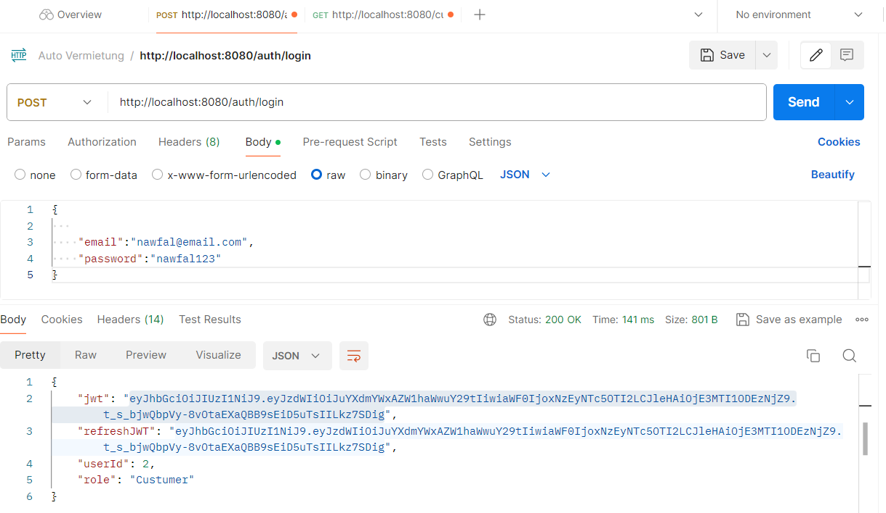

<h1>Auto Vermietung App</h1>

Die Autovermietungsplattform ermöglicht es Benutzern, Autos zu mieten, um die Plattform zu benutzen, muss der Benutzer erstmal zu registrieren und dann sich einlogen. Die App hat auch ein Admin Profile, um die Autos
und Bookings zu verwalten.

Das Backend ist mit Springboot implementiert,und die Sicherheit wird durch Spring Security und JWT-Token gewährleistet. Jeder API-Zugriff erfordert ein gültiges JWT-Token, das beim erfolgreichen Login eines Benutzers generiert wird. Die Rollenbasierte Autorisierung ist implementiert, wodurch verschiedene Endpunkte je nach Benutzerrolle zugänglich sind. Zum Beispiel können Administratoren auf administratives Dashboard zugreifen, während normale Benutzer auf die Hauptseite und Funktionen zur Fahrzeugauswahl zugreifen können.

<h3>Login und JWT Token generierung:  </h3>

