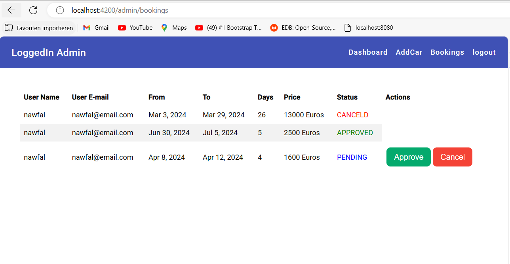

<h1>Auto Vermietung App</h1>

Die Autovermietungsplattform ermöglicht es Benutzern, Autos zu mieten, um die Plattform zu benutzen, muss der Benutzer erstmal zu registrieren und dann sich einlogen. Die App hat auch ein Admin Profile, um die Autos
und Bookings zu verwalten.

<h3>Backend</h3>

---------------

Das Backend ist mit Springboot implementiert,und die Sicherheit wird durch Spring Security und JWT-Token gewährleistet. Jeder API-Zugriff erfordert ein gültiges JWT-Token, das beim erfolgreichen Login eines Benutzers generiert wird. Die Rollenbasierte Autorisierung ist implementiert, wodurch verschiedene Endpunkte je nach Benutzerrolle zugänglich sind. Zum Beispiel können Administratoren auf administratives Dashboard zugreifen, während normale Benutzer auf die Hauptseite und Funktionen zur Fahrzeugauswahl zugreifen können. für die Implementierung der Sicherheit und JWT-Token sehe Packages <b>config</b> und <b>utils</b>

<h3>Login und JWT Token generierung:  </h3>

<h3>Navigation mit JWT Token:</h3>

<h3>Frontend</h3>

---------------

Das Frontend ist mit Angular 16 implementiert, und der Kommunikation mit Bachend erfoglt durch Rest API mit JWT-Token in Headers

<h3>Signup und Login Views</h3>

<h3>Customer Views:</h3>

................

<h3>Dashboard:</h3>

in Dashboard werden alle Autos gezeigt, falls ein Auto von einem Kunde schon gebucht oder gemietet ist, wird die "book car" button nicht gezeigt.

<h3>Book Car View:</h3>

Customer kann ein Auto buchen, die buchung wird dann auf Buchung warteliste gesetzt bis der Admin sie bestätigt oder halt absagt 

<h3>My Bookings View:</h3>

Hier kann der Kunde sehen ob seine Buchung bestätigt oder abgesagt wurde oder halt noch nicht bearbeitet

<h3>Admin Views:</h3>

................

Der Admin kann neue Autos hinzufügen, updaten oder löschen, er kann auch Buchungen verwalten.

<h3>Dashboard:</h3>

<h3>Update Car View:</h3>

<h3>Add Car View:</h3>

<h3>Bookings View:</h3>

Hier kann Admin die Buchung bestätigen oder löschen, die aktuelle Buchung Statue wird auch in Customer Booking View angezeigt.

